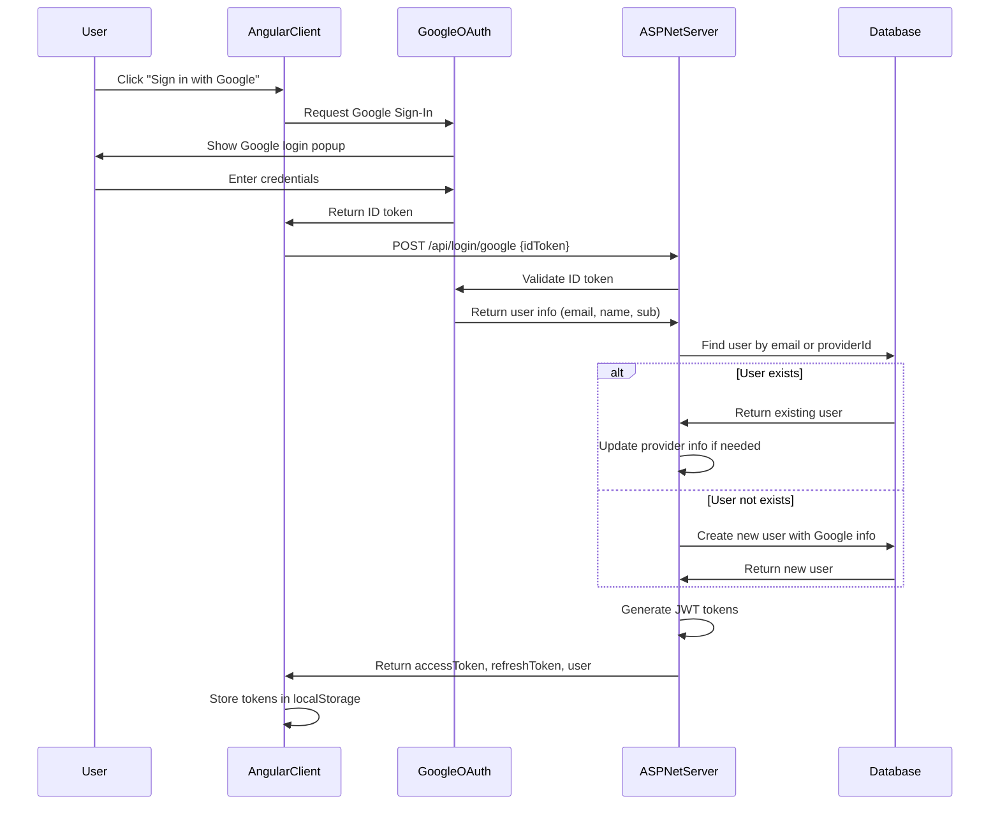

# Google Lo

gin/Register Implementation Plan

## Overview

Implement Google OAuth authentication for both server (ASP.NET Core) and client (Angular). The flow will validate Google ID tokens on the server, find or create users, and return JWT access/refresh tokens similar to the existing login flow.

## Architecture Flow




## Server-Side Implementation

### 1. Update Repository Interface and Implementation

**Files to modify:**

- `RoomRentalManagerServer.Domain/Interfaces/UserInterfaces/IUserRepository.cs` - Add method to find user by provider

- `RoomRentalManagerServer.Infrastructure/Repositories/UserRepositories/UserRepository.cs` - Implement the method

**Changes:**

- Add `GetUserByProviderAsync(string provider, string providerId)` method

- Add `GetUserByEmailOrProviderAsync(string email, string provider, string providerId)` method for flexible lookup

### 2. Update Application Service Interfaces

**Files to modify:**

- `RoomRentalManagerServer.Application/Interfaces/IGoogleTokenValidatorAppService.cs` - Add ValidateIdTokenAsync method signature

- `RoomRentalManagerServer.Application/Interfaces/IUserAppService.cs` - Add FindOrCreateGoogleUserAsync method

**Changes:**

- The GoogleTokenValidatorAppService already has ValidateIdTokenAsync implemented, just need to expose it in interface

- Add `Task<UserDto> FindOrCreateGoogleUserAsync(GoogleTokenPayload googlePayload)` to IUserAppService

### 3. Implement User Service Method

**File to modify:**

- `RoomRentalManagerServer.Application/Services/UserAppService.cs`

**Implementation logic:**

- Check if user exists by providerId (Google sub)

- If not found, check by email (for auto-linking)

- If found by email, update provider and providerId fields

- If not found at all, create new user with:

- Email from Google

- Name from Google
- Avatar from Google picture URL
- Provider = "Google"

- ProviderId = Google sub

- Password = null or generated (since Google users don't need password)

- RoleGroupId = from configuration (default role for Google users)

- Other fields can be null/empty initially

### 4. Add Google Login Endpoint

**File to modify:**

- `RoomRentalManagerServer.API/Controllers/LoginController.cs`

**New endpoint:**

- `POST /api/login/google` - Accepts `{ idToken: string, rememberMe: boolean }`

- Validates Google ID token using GoogleTokenValidatorAppService

- Calls FindOrCreateGoogleUserAsync

- Generates JWT access token and optional refresh token (if rememberMe)

- Returns LoginResponseDto (same format as regular login)

### 5. Update Configuration

**File to modify:**

- `RoomRentalManagerServer.API/appsettings.json`

**Add:**

- `"Google:DefaultRoleGroupId": "0"` - Configurable default role for new Google users

### 6. Update Repository Update Method

**File to modify:**

- `RoomRentalManagerServer.Infrastructure/Repositories/UserRepositories/UserRepository.cs`

**Changes:**

- Update `UpdateAsync` to also update Provider and ProviderId fields when present

## Client-Side Implementation (Angular)

### 1. Install Dependencies

**Command to run:**

```bash
npm install @angular/google-signin
```

Or use Google Identity Services (recommended for 2024+)

### 2. Create Google Auth Service

**New file:** `D:\Working\angular-google-auth-service.ts`**Features:**

- Initialize Google Sign-In

- Handle Google authentication callback
- Get ID token from Google
- Call server API with ID token

- Store JWT tokens in localStorage/sessionStorage

### 3. Create Google Login Component

**New file:** `D:\Working\angular-google-login-component.ts`**Features:**

- Google Sign-In button
- Handle click event
- Show loading state

- Handle success/error responses

- Redirect after successful login

### 4. Update App Module/Standalone Component

**Instructions:**

- Import Google Sign-In script in index.html or use Angular service

- Configure Google Client ID

- Add Google auth service to providers

- Add login component to routes

### 5. Create HTTP Interceptor (Optional)

**New file:** `D:\Working\angular-auth-interceptor.ts`

**Features:**

- Add JWT token to Authorization header

- Handle token refresh

- Redirect to login on 401

## Configuration Requirements

### Server Configuration

- `GOOGLE_CLIENT_ID` - Already configured in appsettings.json

- `Google:DefaultRoleGroupId` - New configuration for default role

### Client Configuration

- Google Client ID (same as server)

- API base URL for login endpoint

## Database Considerations

The User table already has:

- `provider` column (string) - Store "Google"

- `providerId` column (string) - Store Google "sub" (subject ID)

- `avatar` column (string) - Can store Google profile picture URL

No migration needed - columns already exist.

## Error Handling

### Server Side:

- Invalid Google token → 401 Unauthorized

- Email already exists but can't link → 400 Bad Request with message

- Database errors → 500 Internal Server Error

### Client Side:

- Google Sign-In cancelled → Show message

- Network errors → Show error message

- Invalid token → Redirect to login

## Security Considerations

1. Always validate Google ID token on server (never trust client)

2. Use HTTPS in production

3. Store refresh tokens securely (already using Redis)

4. Validate token expiration

5. Check email_verified claim from Google

## Testing Checklist

### Server:

- [ ] Valid Google token returns user and JWT

- [ ] New user is created with correct Google info

- [ ] Existing user by email is auto-linked

- [ ] Existing user by providerId returns same user

- [ ] Invalid token returns 401

- [ ] Refresh token works for Google users

### Client:

- [ ] Google Sign-In button appears

- [ ] Clicking button opens Google popup

- [ ] Successful login stores tokens

- [ ] User info is displayed

- [ ] Logout clears tokens

- [ ] Token refresh works

## Files to Generate

All Angular client files will be generated in `D:\Working\`:

1. `angular-google-auth-service.ts` - Google authentication service

2. `angular-google-login-component.ts` - Login component with Google button

3. `angular-auth-interceptor.ts` - HTTP interceptor for JWT tokens

4. `angular-google-config.ts` - Configuration file for Google Client ID